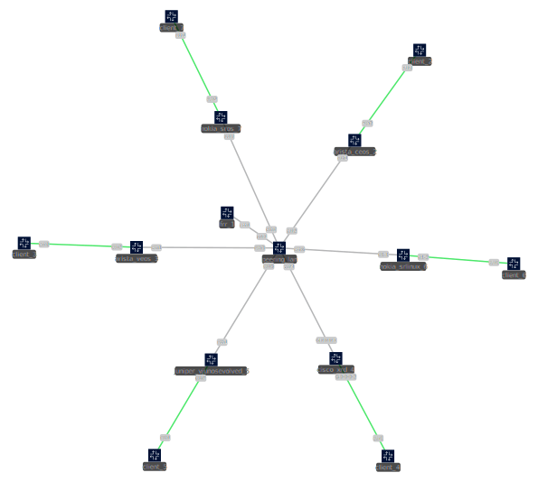

# Compatability
## Legend
- ✅ = tested, working
- ❎ = tested, not working but expected behaviour
- ❌ = tested, not working
- ❗ = tested, limited functionality
- ❔ = not tested, missing functionality

## Matrix
|  Type |  Vendor |  Platform | Arista EOS | Cisco IOS XE | Cisco IOS XR | Cisco NX-OS | Extreme  | Huawei  | Juniper Junos OS | Mikrotik RouterOS | Nokia SR Linux | Nokia SR OS |  BIRD |  FRR |  OpenBGPD |  Notes |
|------------------|--------------|--------------|----|----|----|----|----|----|----|----|----|----|----|----|----|---------------------------------------------------------------|
| **Router**       | **Arista**   | **EOS**      | ✅ | ❗ | ✅ | ❔ | ❔ | ❔ | ✅ | ✅ | ✅ | ✅ | ✅ | ✅ | ✅ |                                                               |
|                  | **Cisco**    | **IOS XE**   | ❗ | ❗ | ❗ | ❗ | ❗ | ❗ | ❗ | ❗ | ❗ | ❗ | ❗ | ❗ | ❗ | Cisco IOS XE only supports a very limited subset of SAFIs[^1] |
|                  | **Cisco**    | **IOS XR**   | ✅ | ❗ | ✅ | ❔ | ❔ | ❔ | ✅ | ✅ | ✅ | ✅ | ✅ | ✅ | ✅ |                                                               |
|                  | **Cisco**    | **NX-OS**    | ❔ | ❗ | ❔ | ❔ | ❔ | ❔ | ❔ | ❔ | ❔ | ❔ | ❔ | ❔ | ❔ |                                                               |
|                  | **Extreme**  |              | ❔ | ❗ | ❔ | ❔ | ❔ | ❔ | ❔ | ❔ | ❔ | ❔ | ❔ | ❔ | ❔ |                                                               |
|                  | **Huawei**   |              | ❔ | ❗ | ❔ | ❔ | ❔ | ❔ | ❔ | ❔ | ❔ | ❔ | ❔ | ❔ | ❔ |                                                               |
|                  | **Juniper**  | **Junos OS** | ✅ | ❗ | ✅ | ❔ | ❔ | ❔ | ✅ | ✅ | ✅ | ✅ | ✅ | ✅ | ✅ |                                                               |
|                  | **Mikrotik** | **RouterOS** | ✅ | ❗ | ✅ | ❔ | ❔ | ❔ | ✅ | ✅ | ✅ | ✅ | ❔ | ❔ | ❔ |                                                               |
|                  | **Nokia**    | **SR Linux** | ✅ | ❗ | ✅ | ❔ | ❔ | ❔ | ✅ | ✅ | ✅ | ✅ | ✅ | ✅ | ✅ |                                                               |
|                  | **Nokia**    | **SR OS**    | ✅ | ❗ | ✅ | ❔ | ❔ | ❔ | ✅ | ✅ | ✅ | ✅ | ✅ | ✅ | ✅ |                                                               |
| **Route Server** |              | **BIRD**     | ✅ | ❗ | ✅ | ❔ | ❔ | ❔ | ✅ | ❔ | ✅ | ✅ | ✅ | ✅ | ✅ |                                                               |
|                  |              | **FRR**      | ✅ | ❗ | ✅ | ❔ | ❔ | ❔ | ✅ | ❔ | ✅ | ✅ | ✅ | ✅ | ✅ |                                                               |
|                  |              | **OpenBGPD** | ✅ | ❗ | ✅ | ❔ | ❔ | ❔ | ✅ | ❔ | ✅ | ✅ | ✅ | ✅ | ✅ |                                                               |

## Setup

## More Information
- For further resources on compatability and feature support, check out the seperate pages for [routing](Routing.md) and [peering](Peering.md).
- Example configuration templates can be found [here](files/templates/). To create your own, follow the [checklist](Checklist.md).

## Findings
- Routers:
	- Arista EOS sends ICMP messages from the management interface if it is in the same VRF, leaking the management IP address.
	- Cisco IOS XE only supports a very limited subset of SAFIs.
	- Cisco IOS XR sends ICMP messages from the management interface if it is in the same VRF, leaking the management IP address.
	- Cisco IOS XR prefers link-local next-hops while not providing a way to configure this behaviour. This can cause connectivity issues in cases where `next-hop self` only updates the GUA.
- Route Servers:
	- BIRD has limited functionality for configuring the next-hop type preference.
	- ExaBGP cannot modify the route table.
	- GoBGP cannot modify the route table.
	- OpenBGPD does not install routes into the FIB yet.
- Operating Systems:
	- Linux can install IPv4 routes with an IPv6 next-hop only via Netlink and not e.g. `ip route add`. It can forward IPv4 packets on IPv6 interfaces natively.
	- OpenBSD cannot install IPv4 routes with an IPv6 next-hop. It is unclear if it can forward IPv4 packets on IPv6 interfaces.

## Conclusion
- almost all major vendors support RFC 8950, many smaller ones do not yet
- all vendors that support it do so fully and properly
- not all vendors support RFC 2545 from 1999 (!) properly
- the actual implementation-specific behaviour still differs in almost all aspects from vendor to vendor
- unintuitively, while route servers offer at least some configurability, at least to my knowledge no routers do
- there is a IETF IDR WG draft to address the behaviour and configurability issues

## Links
- https://en.wikipedia.org/wiki/List_of_open-source_routing_platforms
- https://github.com/Exa-Networks/exabgp/wiki/Other-OSS-BGP-implementations
- https://elegantnetwork.github.io/posts/comparing-open-source-bgp-stacks/
- https://datatracker.ietf.org/doc/draft-ietf-idr-linklocal-capability/

## References
[^1]: https://www.cisco.com/c/en/us/td/docs/routers/ios/config/17-x/ip-routing/b-ip-routing/m-support-bgp-vpn-evpn-nexthop.pdf